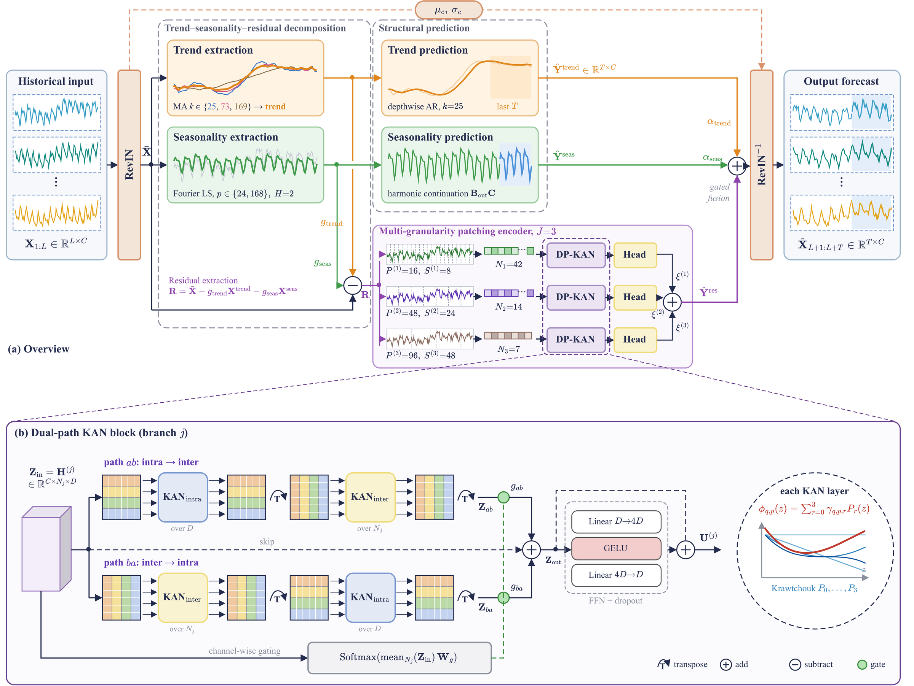
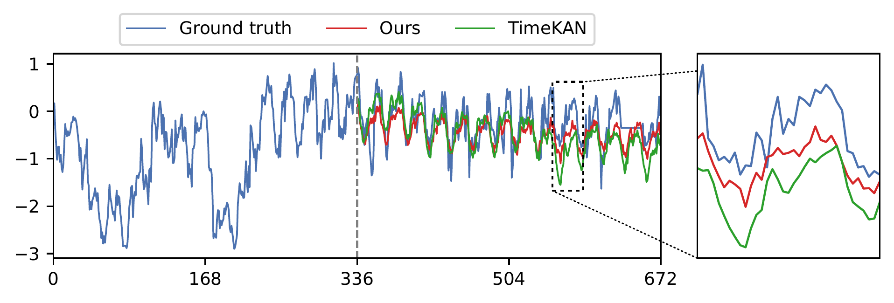
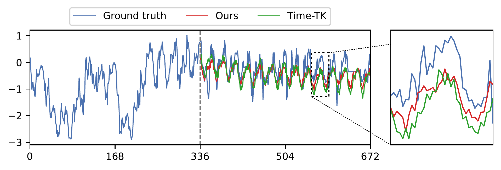
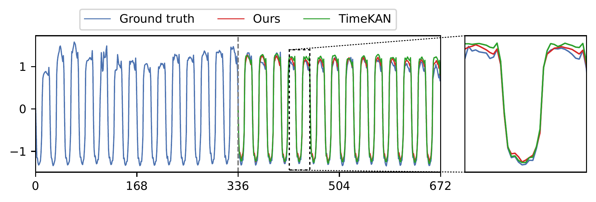
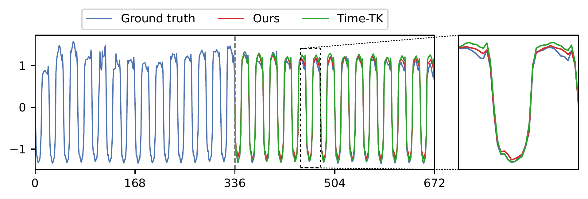
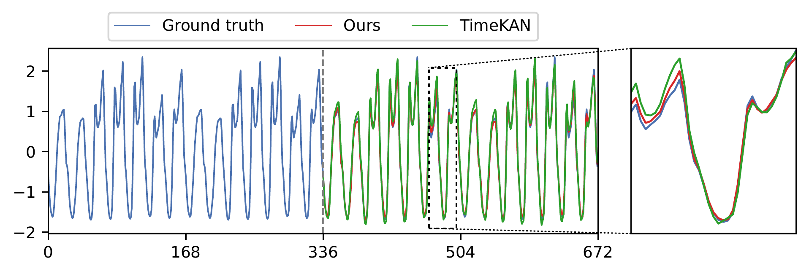
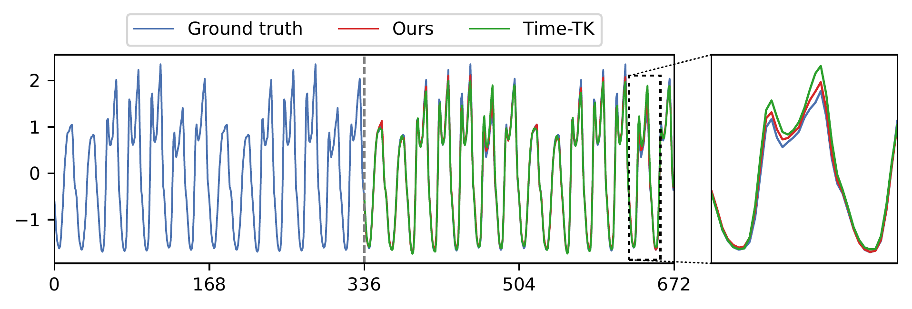

# DEKAN

DEKAN is a decomposition-driven, patch-based model for long-term multivariate time series forecasting. The input is split into trend, seasonal and residual components. Trend and seasonality are extrapolated with lightweight heads, and the residual is modeled by parallel patch branches whose embeddings are mixed by a dual-path KAN block with Krawtchouk polynomial basis.

## Architecture



## Forecast Visualization

Forecasts with look-back window L = 336 and prediction length T = 336.

| | vs. TimeKAN | vs. Time-TK |
|---|---|---|
| ETTh2 |  |  |
| Electricity |  |  |
| Traffic |  |  |

## Get Started

1. Install Python 3.10+ and the requirements: `pip install -r requirements.txt`.
2. Download the datasets (ETTh1, ETTh2, ETTm1, ETTm2, Weather, Electricity, Traffic) from the Google Drive linked in [Autoformer](https://github.com/thuml/Autoformer) and put the csv files directly in `./dataset/`.
3. Train and evaluate. Each script runs all four horizons of one dataset with look-back 336:

```
bash scripts/LONG/etth1.sh
```

## Acknowledgement

We thank the authors of the following repositories for their code and datasets:

https://github.com/yuqinie98/PatchTST

https://github.com/networkslab/MTST

https://github.com/thuml/Autoformer

https://github.com/ts-kim/RevIN

https://github.com/Blealtan/efficient-kan

https://github.com/GistNoesis/FourierKAN
